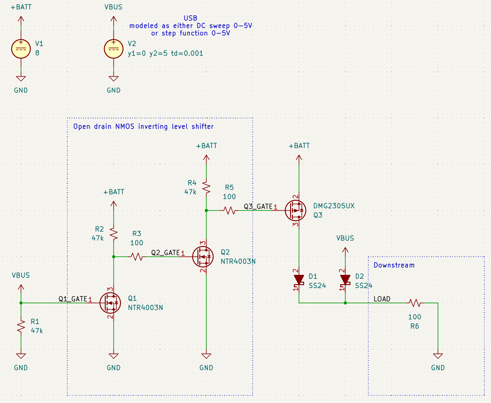
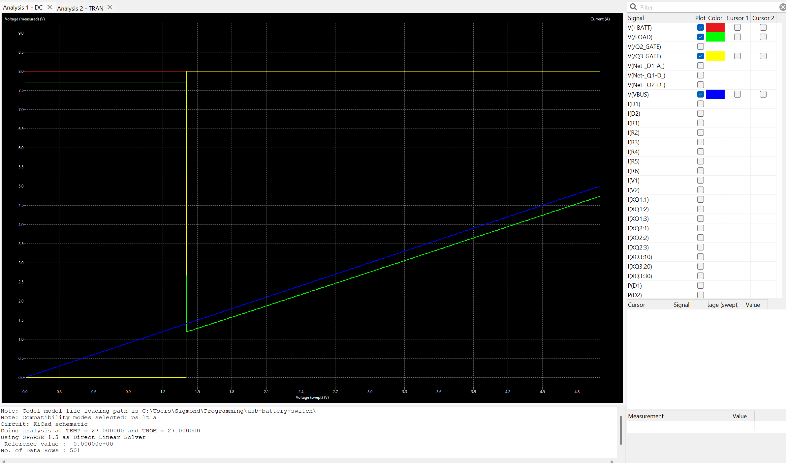
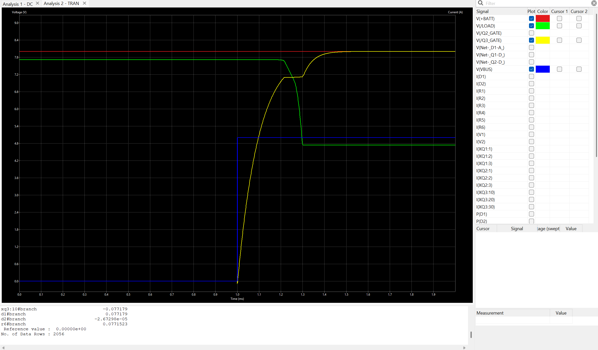

# usb-battery-switch

Cost-effective switch prioritizing USB power supply over lithium battery.
Designed for USB 4.5V<=VBUS<=5.5V and a 2S LiPo (7.4V nominal) battery.

When USB is plugged in, the two NMOS FETs act together as an inverting level shifter that allows the PMOS to be pulled high and thus battery power switched off. When VBUS is removed, the PMOS is pulled low by the second NMOS, resulting in it conducting and allowing battery power to flow to the load.

Reverse current is protected for both VBUS and BATT+ via a pair of schottky diodes with Vf<=500mV.

A good excuse for me to practice SPICE simulation in KiCad!

## Schematic

## Analysis

